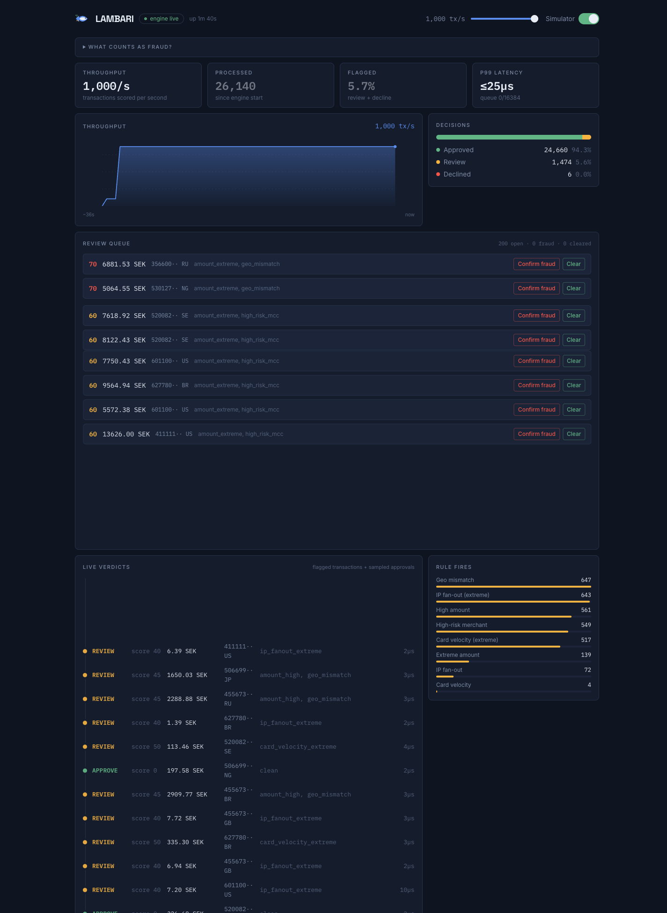
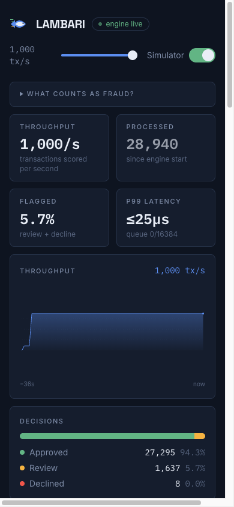

# Lambari — real-time fraud scoring pipeline (PoC)

**[Live demo →](https://lambari-frontend.vercel.app)** (the API may take a moment to wake up; flip **Simulator** on to send traffic)

<p>
  
  
</p>

A full-stack anti-fraud proof of concept: a Go worker-pool engine that scores
payment transactions against velocity, geo, amount, and merchant-risk rules,
fed either over HTTP or Kafka, with a live React dashboard streaming verdicts
over SSE.

**Measured on a Mac mini M1 (8 cores, 16 GB)** — a developer laptop, not a tuned
deployment. Every figure is what the server *kept*; shed load is counted
separately and never folded into the rate.

- **~1.0–2.4M tx/s** scoring throughput with no IO (`make bench`, six runs),
  up from ~620–760k once each velocity window was capped at 30 timestamps
  (measured back to back on the same machine). p99 scoring latency in the **≤50µs** bucket. It moves
  run to run with thermal state and what else is on the machine, so it is a range
  rather than a figure. This is the engine in isolation — the ceiling the rest of
  the pipeline is measured against, not a system throughput number.
- **~447,000 tx/s** peak over the HTTP ingest path at 6 concurrent senders,
  shedding 7.7% — with the load generator on the same 8 cores as the server, so
  the server-only ceiling is higher. Past the peak more load buys less work: at 16
  senders the server accepts ~273,000 tx/s while shedding 52.5% — congestion
  collapse, which is why ingest sheds a prefix and answers 503 rather than queueing.
- **~150,000–180,000 tx/s** sustained through the full Kafka path — consume,
  score, publish verdict, commit — with one consumer. This is the honest
  end-to-end number, and roughly 3× slower than producing into the topic.
- Kafka transaction-to-verdict delivery is **at-least-once**, proven by a test
  that SIGKILLs the consumer mid-batch against a real broker and asserts every
  expected verdict reaches the output topic (`make e2e`). The in-memory case
  queue is outside that guarantee; see [Delivery semantics](#delivery-semantics).
- **The wall is state memory, not scoring CPU**: sustained load grows the live
  heap into the gigabytes and GC takes over long before scoring runs out of CPU.
  See [What actually limits it](#what-actually-limits-it-state-memory-not-scoring-cpu).

Stage-by-stage figures: [Throughput ceiling (measured)](#throughput-ceiling-measured).

Includes **case management**: every review/decline verdict opens a case in
a review queue (worst score first). Analyst resolutions — confirmed fraud
or false positive — are stored as labels, i.e. training data for a future
ML rule. In-memory for the PoC behind a `Store` interface; `schema.sql`
defines the identical Postgres shape.

The queue is live but holds still while your pointer is over it — at a few
thousand transactions per second the server re-ranks cases faster than a human
can aim at a button. Resolving is optimistic and rolls back with a visible
error if the server refuses.

## Stack

| Layer | Choice | Why |
|---|---|---|
| Engine/API | Go 1.22+, stdlib `net/http` | Goroutine worker pool, method-pattern routing, zero framework overhead |
| Event bus | Kafka API via [franz-go](https://github.com/twmb/franz-go), Redpanda broker | Fastest pure-Go client; Redpanda = Kafka without ZooKeeper/JVM |
| Dashboard | React 19 + TypeScript 5.7 + Vite 6 | |
| Styling | Tailwind CSS v4 (CSS-first `@theme`) | |
| Motion | [motion](https://motion.dev) v12 (`motion/react`) | Feed entry animations, animated bars |
| Primitives | Radix UI (Slider, Switch) | Accessible simulator controls |
| Live updates | Server-Sent Events | One-directional stats push — simpler than WebSocket, auto-reconnects |

## Run it locally

### 1. Prerequisites

| Tool | Needed for | Install (macOS) |
|---|---|---|
| Go 1.22+ | backend | `brew install go` |
| Node 22 + pnpm | dashboard | `brew install node && corepack enable` |
| Docker engine | Kafka mode only | `brew install colima docker` |

Any Docker engine works. [Colima](https://github.com/abiosoft/colima) is a free,
CLI-only one: it runs Docker in a small Linux VM. It ships without the Compose
plugin, so step 4 starts the broker with plain `docker run`.

### 2. Install and run (no Kafka)

```bash
make setup       # Go modules + pnpm install
make run-api     # terminal 1: engine + API on :8080
make run-web     # terminal 2: dashboard on :5173
```

`make build` compiles `backend/api` and `backend/loadgen` if you'd rather run
binaries than `go run`.

Open http://localhost:5173, turn on **Simulator**, and set a rate. The
generator mixes in ~8–10% fraud patterns: card-testing rings, velocity
attacks, stolen cards used abroad, high-risk merchants.

### 3. Check it

```bash
make test        # Go tests
make test-web    # dashboard tests
make bench       # engine throughput, no IO
make loadgen     # POST 5000 tx/s to /api/transactions for 30s (API must be running)
```

To find a ceiling instead of holding a rate, run the generator unthrottled and
add senders until throughput stops rising. Restart the API between runs, since
state left by one run slows the next:

```bash
cd backend && go run ./cmd/loadgen -rate 0 -workers 8 -batch 500 -duration 30s
```

Each run reports the rate the server kept and what it shed.
[Measured results](#throughput-ceiling-measured) are below.

### 4. Kafka mode

```bash
colima start                      # skip if another Docker engine is running
docker run -d --name lambari-redpanda -p 19092:19092 redpandadata/redpanda:v24.2.7 \
  redpanda start --smp 1 --overprovisioned --mode dev-container \
  --kafka-addr external://0.0.0.0:19092 --advertise-kafka-addr external://localhost:19092

make kafka-run       # terminal 1: API consuming the `transactions` topic
make kafka-loadgen   # terminal 2: produce 5000 tx/s into it
make e2e             # crash-replay proof (~50s): SIGKILL mid-batch, every verdict still arrives
make rebalance       # state-loss proof (~6s): SIGTERM one of two consumers, count lost windows
```

With the Compose plugin, `make kafka-up` replaces the `docker run` and adds the
Redpanda Console on http://localhost:8081. Every other target only needs a
broker on `localhost:19092` and says so if there isn't one.

### 5. Stop

```bash
docker rm -f lambari-redpanda
colima stop
```

## Deploy (Render free + Vercel)

The API runs as one Docker service on Render's free plan; the dashboard stays
on Vercel and calls it directly. The full runbook (verification, rollback,
troubleshooting) is in [docs/deploy.md](docs/deploy.md).

1. **API on Render.** Dashboard → **New → Blueprint** → pick this repo. It
   reads [`render.yaml`](render.yaml) and asks for `LAMBARI_ALLOWED_ORIGINS`:
   your Vercel URL, e.g. `https://lambari-frontend.vercel.app` (comma-separate several). Deploys follow pushes to `main`.
2. **Dashboard on Vercel.** Project → Settings → Environment Variables → add
   `VITE_API_BASE` = the Render URL, e.g. `https://lambari-api.onrender.com`.
   Redeploy: Vite bakes the value in at build time.
3. **Check it.** Open the Vercel URL; the header should read *engine live*.

What the free plan means:

- It sleeps after 15 minutes without traffic, and waking takes about a
  minute. An open dashboard keeps it awake. Sleeping resets every case and
  velocity window: they live in memory.
- It must stay one instance. A second would split the in-memory state.
- The API has no auth, so `render.yaml` sets demo limits: the simulator is
  capped at 1,000 tx/s and stops itself after 10 minutes, and
  `POST /api/transactions` is off, since it would bypass that cap. Anyone with
  the URL can still start the simulator and resolve cases.

| Variable | Default | Purpose |
|---|---|---|
| `PORT` / `LAMBARI_ADDR` | `:8080` | Listen address. Render sets `PORT`. |
| `LAMBARI_ALLOWED_ORIGINS` | none | Origins that get CORS headers |
| `LAMBARI_SIM_MAX_RATE` | `100000` | Simulator ceiling, tx/s |
| `LAMBARI_SIM_MAX_DURATION` | none | Simulator stops itself after this, e.g. `10m` |
| `LAMBARI_DISABLE_INGEST` | `false` | `true` answers `POST /api/transactions` with 403 |

## Kafka mode

Records are keyed by card token so one card's events stay ordered within a
partition — the velocity rules depend on that. Backpressure is natural:
if the engine saturates, polling slows and consumer lag becomes visible
(and alertable) in Kafka.

### Delivery semantics

> **This section is the canonical statement of the delivery contract.** It got
> restated in five other files, drifted, and had to be corrected in four of
> them; everything else now links here instead of paraphrasing. If a claim
> about duplicates appears somewhere without a link to this section, that copy
> is the bug.

The pipeline is **at-least-once**. Nothing here is exactly-once, and the
duplicates that implies land in three different places with three different
answers — the last bullet is the one that matters.

- Offsets are committed only after the engine has finished scoring the batch —
  `SubmitBatch` blocks until every transaction is done. Committing after
  *enqueue* would be at-most-once, losing whatever was still buffered on a
  crash, silently.
- The verdict and DLQ producers are flushed **before** every commit. They
  publish asynchronously, so committing first would let a crash discard
  buffered publishes the offsets already claimed were handled.
- A flush only proves every publish *finished*, not that it *succeeded* — kgo
  returns nil either way. The producers count failures themselves, and one
  failure stops committing for good: the next commit would cover the failed
  batch's offsets too. The consumer stops, the process exits non-zero, and the
  restart replays from the last good commit.
- Records that fail to decode go to `transactions.dlq` with origin headers
  rather than a log line, and don't block the rest of the batch.
- Rebalances are blocked while a batch is in flight (`BlockRebalanceOnPoll`)
  and allowed only after it is committed, so `OnPartitionsRevoked` runs between
  batches, never inside one. It flushes and commits, bounding redelivery to one
  in-flight batch. Publishes use a context shutdown doesn't cancel, so a SIGTERM
  mid-batch can't fail verdicts that the revoke hook then commits past.
- **Where duplicates actually land** — three different answers, none of them
  "idempotent":
  - *The case queue* suppresses a duplicate **while the case is still open**,
    and only within one process. Resolving or evicting forgets the transaction
    id, so a later replay reopens the case; two group members cannot see each
    other's queues, so neither can suppress the other's duplicate; and the
    store is in memory, so a restart loses every case it held — replay rebuilds
    only those in the uncommitted tail, and everything committed earlier is
    simply gone. That last part is a scope cut, not a subtlety: `schema.sql`
    makes transaction id the primary key, so a Postgres-backed store would
    survive the restart *and* dedupe for the row's lifetime.
  - *Velocity windows and counters* advance a second time. Accepted, because
    that second pass is exactly what rebuilds the windows after a crash.
  - *The verdicts topic* is keyed by transaction id, which lets a downstream
    keyed store or a compacted topic collapse duplicates — but nothing here
    configures compaction or downstream dedupe, so a notification or data-lake
    consumer reading the live stream sees the same verdict twice. Keying makes
    dedupe possible; it does not perform it. A consumer that cannot tolerate a
    repeat needs its own dedupe on the key: that is a contract handed
    downstream, not a property of this system.

  What this design rejects is a **durable or shared processed-set checked before
  scoring**. Because it outlives the in-memory windows, it could remember a
  transaction those windows forgot and skip the replay they need to rebuild. A
  process-local LRU dies with the windows, so it does not block recovery — but
  it also cannot dedupe a crash replay. Deduping at an *effect*, after scoring,
  blocks nothing; the case store already does it, and Postgres would do it
  durably. Placement and lifetime both matter.

`make e2e` proves the Kafka verdict-delivery guarantee: it streams
transactions, SIGKILLs the real consumer mid-batch against Redpanda, restarts
it, and asserts every expected verdict arrived at least once. A graceful
shutdown can't stand in for a crash — the revoke hook correctly commits on the
way out, so the test kills by signal.

### Velocity state is partition-local — and it dies on rebalance

At-least-once covers the *records*. It does not cover the *state* the records
built up. Sliding velocity windows live in the memory of whichever process owns
the partition, and partitions move.

`make rebalance` measures it: two consumers in one group on a 6-partition
topic, 24 cards hammered until each is scored `card_velocity_extreme`, then one
consumer is stopped with **SIGTERM** — an ordinary rolling deploy, not a crash.
A representative run:

```
velocity state after a clean rebalance: 15 of 24 cards lost their window
(partition moved, survivor started from empty), 9 kept it (partition never
moved). Those 15 cards were mid-attack and scored as first-time traffic.
```

Three things worth saying out loud about that number:

- **No error is raised anywhere.** The transactions are consumed, scored and
  answered. Detection quietly gets worse for a minute, then heals as the
  windows refill.
- **The damage is partial.** Cards on partitions that never moved keep their
  history, so no aggregate metric shows a cliff — which is what makes it hard
  to notice in production.
- **A crash is the same failure, delayed.** SIGTERM leaves the group
  immediately; SIGKILL strands the partitions until the session timeout
  (~45s) and *then* does the same thing.

This is the honest argument for external state (Redis, or Flink keyed state
with checkpoints) rather than a hand-wave: the windows are the thing that
cannot be rebuilt from an offset.

## Throughput ceiling (measured)

Mac mini M1, 8 cores, 16 GB — **client and server share those cores**, so the
server-only ceiling is higher than anything below. Every run reports what the
server *kept*; shed load is counted separately and never folded into the rate.

Stage by stage, each HTTP run against a freshly started engine (15s, batch 500).
These rows predate the 30-timestamp window cap and have not been re-run since:

| Stage | Result |
|---|---|
| Engine alone, no IO (`make bench`) | **711,895 tx/s** (before the window cap; ~1.0–2.4M after) |
| HTTP ingest, 1 worker | 186,536 tx/s · 0% shed |
| HTTP ingest, 2 workers | 308,510 tx/s · 0% shed |
| HTTP ingest, 4 workers | 407,282 tx/s · 0.4% shed |
| HTTP ingest, 6 workers | **447,118 tx/s** · 7.7% shed ← peak |
| HTTP ingest, 8 workers | 363,442 tx/s · 26.9% shed |
| HTTP ingest, 16 workers | 273,148 tx/s · 52.5% shed |
| Kafka produce, 6 partitions | **~430–560k tx/s** |
| Kafka consume + score (one consumer) | **~150–180k tx/s**, lag peaking >2M |

Three things that curve says:

- **Past the peak, more load buys less work.** At 16 workers the server accepts
  *less* than at 4 while shedding half of what it is offered — congestion
  collapse, which is why ingest sheds a prefix and answers 503 instead of
  queueing.
- **Producing is ~3× faster than consuming.** The consumer pays JSON decode,
  scoring, verdict publish and offset commits per record. Under a flood, lag
  climbs past 2M — which is exactly the KEDA signal `/metrics` exports, doing
  the job it was built for.
- **Partition count was the old ceiling, not the broker.** On the
  single-partition topic this repo used to create, producing stalled around
  20k/s with `context deadline exceeded`; at 6 partitions it is 20× that.
  (Across sessions, so not a controlled A/B — but the partition count is the
  variable that changed.)

### What actually limits it: state memory, not scoring CPU

Scoring is not the wall — the engine alone does over 1M tx/s. The wall is the
velocity state. Each transaction touches a card key and an IP key. These
figures were measured when the sweeper kept entries for **10 minutes**, twice
the longest rule window; it now keeps them 5 minutes, which halves retained
state without changing its order of magnitude:

- Live heap reached **2.7 GB after 18 seconds** at ~400k tx/s (`gctrace`),
  RSS 4.2 GB over a 60s run.
- GC went from negligible to **9% of CPU**, with single assist waves of
  1,396 ms.
- Throughput stopped being a number and became a range: a sustained 60s run
  averaged 284k tx/s while swinging between 67k and 545k second to second.
- At the peak, the API process used ~430% CPU of 800% available. It was not
  CPU-starved; it was stalling.

Caveat worth stating: the synthetic generator draws a **random card token and
IP per transaction**, so nearly every transaction mints two new keys — the
worst case. Real traffic repeats cards, and steady-state memory tracks
*distinct keys inside the retention window*, not throughput. What is not an
artifact is the shape of the bound: memory grows with distinct keys over the
retention window, and at its peak rate the process cannot hold even one sweep
interval's worth.

Both experiments in this README end at the same place. The in-memory sliding
window is what breaks correctness when a partition moves, and what breaks
capacity when traffic is sustained.

## Architecture

```
                    ┌──────────────────────────────────────────────┐
 loadgen ──HTTP──►  │  API :8080                                   │
                    │   POST /api/transactions  ─┐                 │
 loadgen ──Kafka─►  │  franz-go consumer        ─┤                 │
 (topic:            │   (group: lambari-scoring)│                 │
  transactions)     │                            ▼                 │
                    │   ┌────────────────────────────────┐         │
                    │   │ Engine: 16k buf, one queue/card│         │
                    │   │  → N×2 CPU workers             │         │
                    │   │  → rules: amount · velocity ·  │         │
                    │   │     ip fan-out · geo · MCC     │         │
                    │   │  → score ⇒ approve/review/     │         │
                    │   │            decline             │         │
                    │   └────────────────────────────────┘         │
                    │   atomics + sharded sliding windows (256)    │
                    │                            │                 │
                    │   GET /api/stream (SSE) ◄──┤                 │
                    │   GET /metrics (Prom)   ◄──┘                 │
                    └──────────────┬───────────────────────────────┘
                                   ▼
                        React dashboard :5173
              stats · throughput chart · live verdict feed
```

### Engine design notes

- **Worker pool, not per-request goroutines**: `2 × NumCPU` workers, each with
  its own queue (16,384 slots in total). A card always goes to the same queue,
  so its transactions are scored in order and the velocity flag lands on the
  right one. `Submit` blocks when that queue is full — backpressure propagates
  upstream instead of OOMing. The price: one hot card is limited to one
  worker.
- **Sharded velocity state**: sliding-window counters live in 256 mutex
  shards keyed by FNV hash, so thousands of concurrent workers don't fight
  over one lock. A background sweeper evicts idle keys to keep memory flat.
- **Late events**: each window is kept sorted by timestamp, so an event that
  arrives out of order counts what came before it *in time*, and can never
  push newer history out. Entries expire relative to the newest timestamp seen
  for the key. An event older than its whole window is scored alone and leaves
  the window unchanged.
- **Lock-free reads**: counters are atomics; the stats endpoint never stalls
  the hot path. Latency lands in a lock-free bucketed histogram, and the
  dashboard's p50/p99 are read back out of those same buckets.
- **Scoring is additive**: each rule returns points + a flag; ≥40 ⇒ review,
  ≥70 ⇒ decline. Thresholds and the rule chain live in one place
  (`internal/engine/rules.go`) so tuning is a one-line change.

## API

| Endpoint | Purpose |
|---|---|
| `POST /api/transactions` | Batch JSON ingest (the HTTP IO path), max 8 MiB. `400` with the offending `index` if any transaction lacks `id`/`card_hash` or is dated more than 5s ahead; nothing in that batch is scored. `503 + Retry-After` when saturated — see below |
| `POST /api/simulate` | `{"rate": 5000}` starts the built-in generator, `0` stops |
| `GET /api/stats` | Engine snapshot |
| `GET /api/stream` | SSE: stats + recent verdicts + case counts + top 8 open cases every 400ms |
| `GET /api/cases` | Review queue (`?status=resolved` for labeled history) |
| `POST /api/cases/{id}/resolve` | `{"resolution":"confirmed_fraud"\|"false_positive"}` |
| `GET /metrics` | Prometheus scrape (root-level by convention, not under `/api`) |

### Writes must be JSON

Every POST must send `Content-Type: application/json`, or it gets `415`. There
is no auth, and CORS is granted only to `LAMBARI_ALLOWED_ORIGINS` (none by
default). A browser only sends a cross-origin JSON POST after a preflight,
which fails for any other origin, so another website can't resolve cases or
start the simulator. The forms and `text/plain` requests it can send without
a preflight are rejected.

### Backpressure at the ingest boundary

When the engine's buffer is full, `POST /api/transactions` accepts a **prefix**
of the batch and sheds the rest, answering `503` with `Retry-After: 1` and
`{"accepted": N, "rejected": M}`. Accepting a prefix rather than scattered
transactions is what makes `accepted: N` actionable — it means "the first N,
resend from there".

503 rather than 429 because the constraint is this server's capacity, not this
caller's rate. Shed load is counted in `lambari_submissions_rejected_total`.

**The retry contract is "resend from N", and it is not optional.** Re-posting
the whole batch re-scores the prefix the server already accepted: velocity
windows advance twice for those cards, counters and rule fires double-count,
and a second verdict is published. Only the case queue absorbs it, and only
while the case is still open — see [Delivery semantics](#delivery-semantics)
for exactly where duplicates land, which is the canonical statement; this
section does not restate it. That is the trade: `accepted: N` is precise so the
caller can be precise, and a caller that ignores it corrupts velocity state
rather than merely wasting work.

The Kafka path deliberately answers the same question differently — it
*blocks* (`SubmitBatch`) rather than shedding. One consumer loop slowing down
turns into consumer lag: visible, alertable, and already wired to autoscaling.
Blocking at an HTTP boundary would instead spread the pressure across N
uncoordinated callers as latency creep until their timeouts fire, telling
nobody to slow down. Same problem, opposite answer, because the context
differs.

### Metrics

`GET /metrics` serves Prometheus text exposition, hand-written so the repo
keeps its single dependency: transactions scored, decisions by type, rule
fires by name, queue depth against capacity, throughput, uptime, and — in
Kafka mode only — consumer lag per partition plus a summed total.

Scoring latency is exported as a **bucketed histogram**, not a pre-computed
percentile, because a percentile calculated inside one process cannot be
aggregated with another's: averaging eight pods' p99s is meaningless.
Prometheus gets raw buckets it can sum across pods, and the dashboard's p50/p99
are read back out of the same buckets — one latency mechanism in the engine
instead of two. The price is that those numbers are bounds, not measurements,
so the dashboard renders them as bounds: `≤250µs`, and `off scale` past the
largest bucket. Printing `250µs` would be off by up to a full bucket width
while looking exact, and printing the top bound during a stall would turn
"slower than a second" into "exactly one second".

Consumer lag comes from the high watermark that every fetch already carries —
no admin client, no extra round-trips. It is the signal to autoscale on: a
saturated consumer can sit at low CPU while lag climbs, so CPU-based scaling
would never react.

In Kafka mode, every flagged verdict is also published to the `verdicts`
topic (keyed by tx id) for downstream consumers — notifications, data lake,
model training.

## Docs

- [docs/architecture.html](docs/architecture.html) — the as-built system
  diagram, a one-transaction end-to-end walkthrough, the production-shape
  board with the tradeoffs behind each box, and a glossary (standalone page,
  open directly in a browser)
- [docs/interview-kafka-at-least-once.md](docs/interview-kafka-at-least-once.md)
  — why at-least-once over the alternatives, where the crash windows are, and
  what the e2e test actually proves
- [docs/glossary.md](docs/glossary.md) — the project's vocabulary: payments,
  engine, Kafka, API and metrics terms, each pointing at the code
- [docs/knowledge-base.md](docs/knowledge-base.md) — problem framing, stack
  decision record, scoring model, design system, runbook
- [docs/spec.md](docs/spec.md) — requirements: actors, use cases, user
  flows, functional and non-functional requirements, constraints
- [docs/diagrams.md](docs/diagrams.md) — UML: component, sequence, class,
  case-lifecycle state diagram (plain Markdown, GitHub-rendered)

## Where this would go next (production deltas)

Known gaps, stated plainly — the delta between this and production is more
interesting than pretending there isn't one:

- **Velocity state dies on rebalance** — measured, not assumed: `make
  rebalance` loses roughly half the in-flight windows on a clean SIGTERM (see
  above). Redis with a pipelined sliding window, or Flink keyed state with
  checkpoints, is the real fix — and the honest question is what distributing
  that state costs in throughput, which is the next thing to measure.
- **That same state is the throughput ceiling** — also measured: sustained
  load grows the live heap into the gigabytes and GC takes over long before
  scoring runs out of CPU. Retention now matches the longest rule window (5
  min, down from 10), which does not change the order of magnitude. Bounding
  the state is the actual fix, and it is the same fix as the bullet above.
- **The case store is in memory.** Cases and their labels do not survive a
  restart. `schema.sql` is the Postgres shape; the `Store` interface is the
  swap point.
- Swap `cases.MemStore` for a pgx implementation of `cases.Store`
  (`schema.sql` is ready)
- A Python sidecar serving an ML model as one more `Rule` in the chain,
  trained on the resolution labels the queue already collects
- Kubernetes with KEDA scaling on the exported consumer-lag metric, capped at
  the partition count — a consumer group can't usefully exceed it, and idle
  pods still bill you
- OpenTelemetry traces around `score()`; the p99 budget is the SLO
- AuthN on the API (deliberately omitted from this PoC)

## Layout

```
backend/
  cmd/api/          # entrypoint: HTTP + optional Kafka consumer
  cmd/loadgen/      # traffic flood tool (HTTP or Kafka transport)
  internal/engine/  # worker pool, rules, sharded state, latency histogram
  internal/model/   # transaction/verdict types, synthetic generator
  internal/kafka/   # franz-go consumer + producers, lag tracking, crash-replay
                    #   and rebalance-state-loss experiments
  internal/cases/   # review queue store + tests (schema.sql = Postgres shape)
  internal/metrics/ # Prometheus text exposition (no client library)
  internal/api/     # HTTP handlers, SSE stream, simulator, /metrics
frontend/
  src/lib/useStream.ts        # SSE hook over a pure, tested reducer
  src/lib/api.ts              # every fetch, throwing a typed HttpError on non-2xx
  src/lib/casesReducer.ts     # review queue: optimistic resolve, rollback, pause
  src/components/             # StatCard, ThroughputChart, Breakdown,
                              # LiveFeed, SimControl, ReviewQueue
docs/               # knowledge base + UML diagrams
docker-compose.yml  # Redpanda + Redpanda Console
Makefile            # every workflow, one word each
pnpm-workspace.yaml # pnpm workspace root (frontend)
```
