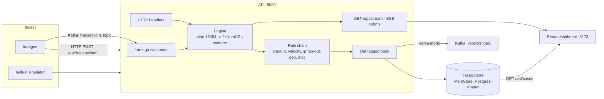
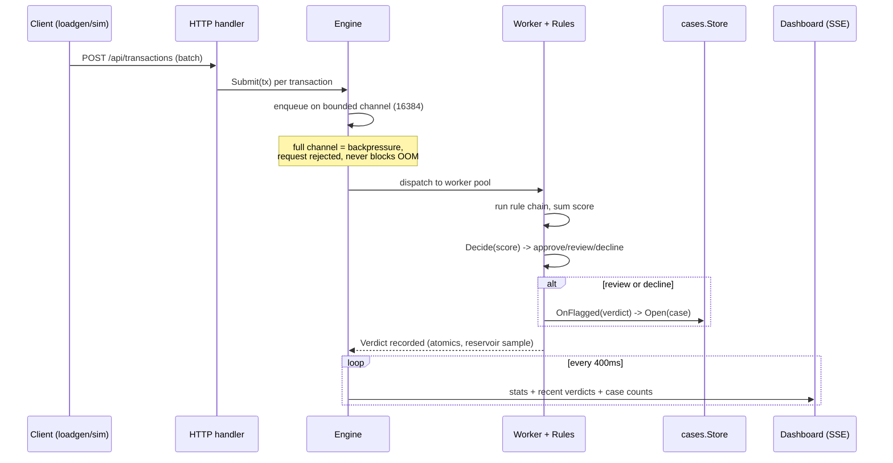
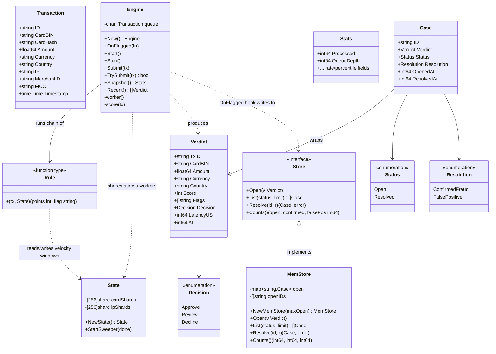
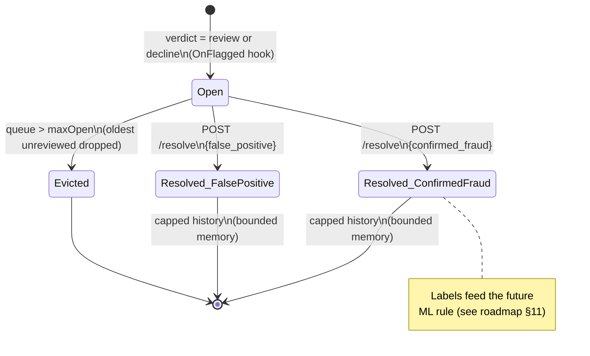

# Tripwire — UML Diagrams

Companion to [knowledge-base.md](knowledge-base.md). GitHub renders these
Mermaid blocks natively — no separate viewer needed.

## Component diagram

How a transaction enters, gets scored, and reaches the dashboard.

## Sequence diagram — one transaction, HTTP path

## Class diagram — core types

## State diagram — case lifecycle

