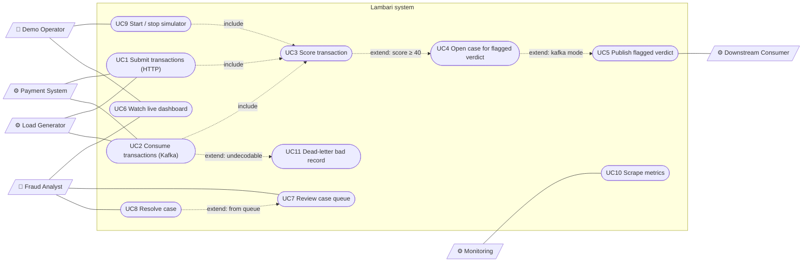
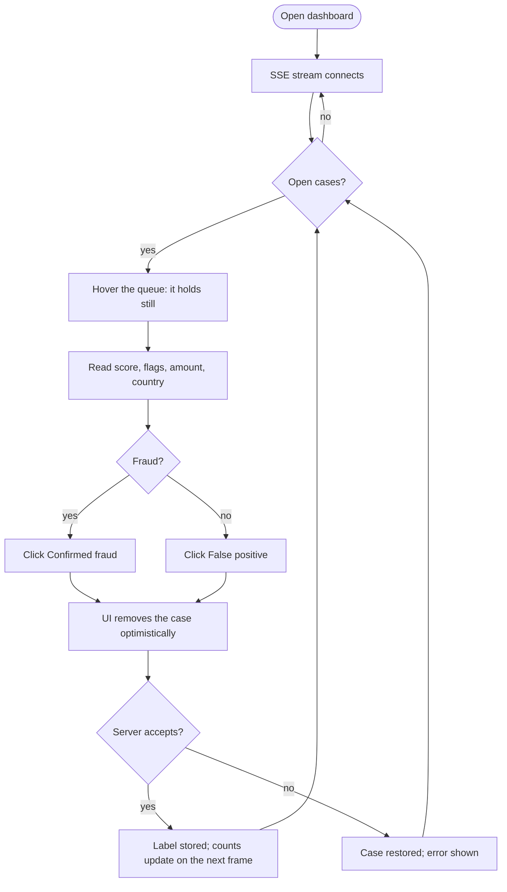
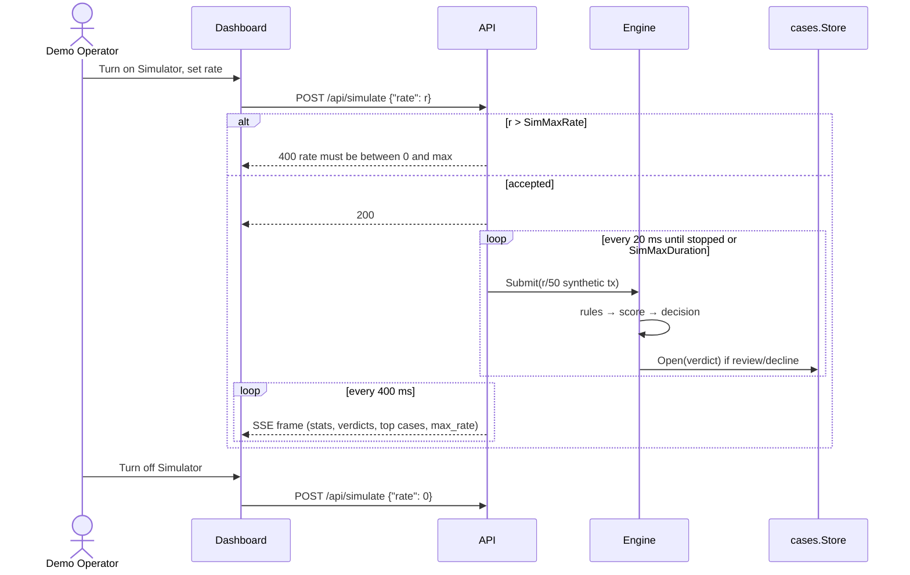
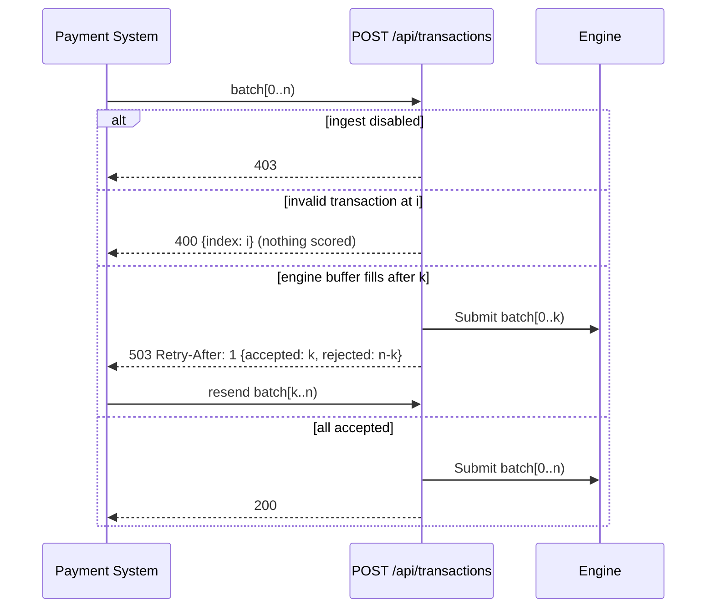
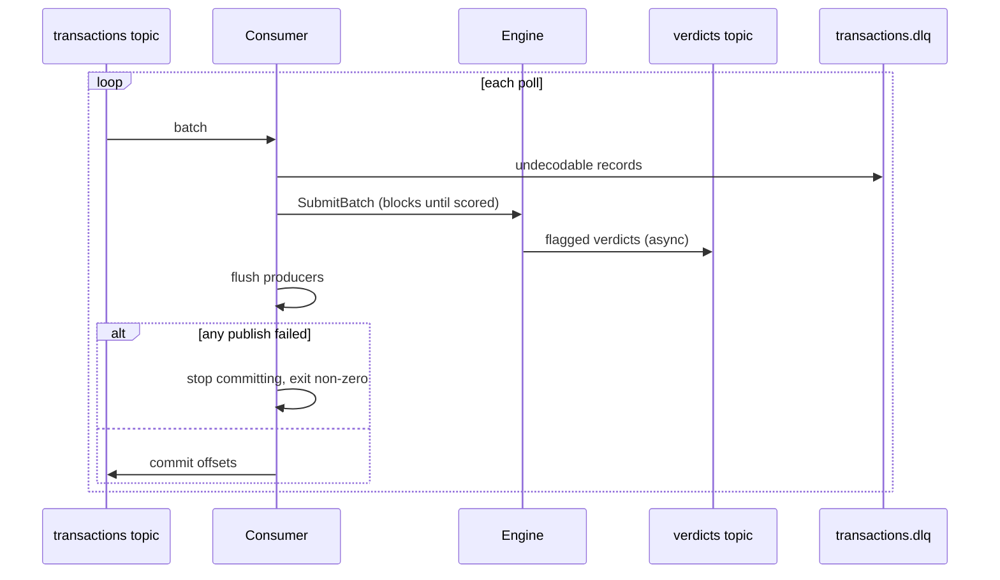

# Lambari — Requirements Specification

What the system must do, for whom, and within which limits. It describes the
system as built. Measured figures and the delivery contract live in the
[README](../README.md) and are linked, not copied. Structural UML (component,
class, case state) is in [diagrams.md](diagrams.md); this page adds the
actors, use cases and user flows. GitHub renders the Mermaid blocks.

## 1. Scope

Lambari is a proof of concept for real-time fraud scoring. It receives
payment transactions over HTTP or Kafka and scores each one against a chain
of rules. Each transaction gets a verdict: approve, review or decline.
Flagged transactions go to a review queue, and verdicts stream live to a
dashboard.

Out of scope: authentication, persistent storage, ML scoring, running more
than one API instance with shared state, and exactly-once delivery.

## 2. Actors

| Actor | Kind | Goal |
| --- | --- | --- |
| **Fraud Analyst** | Human, primary | Watch live scoring and triage flagged cases |
| **Demo Operator** | Human, primary | Drive synthetic traffic to show the system working |
| **Payment System** | System, primary | Submit transactions and get them scored (HTTP batch or Kafka topic) |
| **Downstream Consumer** | System, secondary | Receive flagged verdicts from the `verdicts` topic (notifications, data lake, model training) |
| **Monitoring** | System, secondary | Scrape metrics; alert and autoscale on consumer lag |
| **Load Generator** | Tool, primary | Flood ingest to measure throughput (`cmd/loadgen`) |

In the public demo, Fraud Analyst and Demo Operator are the same anonymous
visitor.

## 3. Use cases

### 3.1 Use case diagram

Mermaid has no native use case diagram. Here actors are slanted boxes, use cases
are rounded ovals, and the system boundary is the subgraph.

### 3.2 Use case catalogue

| ID | Name | Actor | Trigger | Main outcome | Alternatives / errors |
| --- | --- | --- | --- | --- | --- |
| UC1 | Submit transactions | Payment System, Load Generator | `POST /api/transactions` with a JSON array | Every transaction is queued for scoring | `400` + `index` for an invalid transaction, and nothing in the batch is scored. `503` + `Retry-After` + `accepted`/`rejected` when saturated. `415` if not JSON. `403` when ingest is disabled |
| UC2 | Consume transactions | Payment System | Records on the `transactions` topic | Batch scored; verdicts and DLQ flushed; offsets committed | A publish failure stops commits and the process exits, and the restart replays |
| UC3 | Score transaction | (internal) | UC1, UC2 or UC9 | Score = sum of rule points; decision set | — |
| UC4 | Open case | (internal) | Verdict is review or decline | Case added to the open queue | A duplicate tx id is ignored while its case is open. The oldest open case is evicted past capacity |
| UC5 | Publish verdict | Downstream Consumer | Flagged verdict in Kafka mode | Verdict on `verdicts`, keyed by tx id | — |
| UC6 | Watch dashboard | Analyst, Operator | Open the dashboard | Stats, throughput chart, verdict feed and top cases refresh every 400 ms over SSE | The stream reconnects automatically |
| UC7 | Review queue | Analyst | Dashboard or `GET /api/cases` | Open cases, worst score first; `?status=resolved` for history | The queue holds still while the pointer is over it |
| UC8 | Resolve case | Analyst | Click *fraud* / *false positive* | Case resolved; the label is stored | Unknown or already resolved id → `404`. The UI rolls back its optimistic update and shows the error |
| UC9 | Start / stop simulator | Operator | Toggle and rate slider | Synthetic traffic at the chosen rate; `0` stops it | Rate above the cap → `400`. Stops by itself after the configured duration |
| UC10 | Scrape metrics | Monitoring | `GET /metrics` | Prometheus text: counters, latency histogram, queue depth, lag (Kafka mode) | — |
| UC11 | Dead-letter record | (internal) | Kafka record fails to decode | Record sent to `transactions.dlq` with origin headers | — |

## 4. User flows

### 4.1 Analyst triages a case (activity)

### 4.2 Operator runs a demo (sequence)

### 4.3 Payment system submits a batch (sequence)

The client must resend from `accepted`, not the whole batch; see
[Backpressure](../README.md#backpressure-at-the-ingest-boundary).

### 4.4 Kafka consume loop (sequence)

## 5. Functional requirements

| ID | Requirement | Source |
| --- | --- | --- |
| FR-1 | Accept batches of JSON transactions over HTTP, up to 8 MiB | `api/server.go` |
| FR-2 | Reject the whole batch with `400` and the offending index when a transaction lacks `id` or `card_hash`, or is dated more than 5 s ahead | `api/server.go` |
| FR-3 | When saturated, accept a prefix of the batch, shed the rest and answer `503` with `accepted` / `rejected` and `Retry-After: 1` | `api/server.go` |
| FR-4 | Consume the `transactions` topic when `LAMBARI_KAFKA_BROKERS` is set, keyed by card | `internal/kafka` |
| FR-5 | Score every transaction with the rule chain below; the score is the sum of points | `engine/rules.go` |
| FR-6 | Decide: score ≥ 70 → decline, ≥ 40 → review, otherwise approve | `engine/rules.go` |
| FR-7 | Score one card's transactions in order | `engine/engine.go` |
| FR-8 | Open a case for every review or decline verdict. Ignore a duplicate tx id while its case is open | `cases/cases.go` |
| FR-9 | List open cases worst score first; list resolved cases on request | `GET /api/cases` |
| FR-10 | Resolve a case as `confirmed_fraud` or `false_positive` and keep the label | `POST /api/cases/{id}/resolve` |
| FR-11 | Stream stats, recent verdicts, case counts and the top 8 open cases every 400 ms over SSE | `GET /api/stream` |
| FR-12 | Run a built-in traffic generator at a chosen rate, with about 8–10% fraud patterns | `POST /api/simulate` |
| FR-13 | Publish flagged verdicts to `verdicts`, keyed by tx id (Kafka mode) | `internal/kafka` |
| FR-14 | Route undecodable Kafka records to `transactions.dlq` with origin headers | `internal/kafka` |
| FR-15 | Export Prometheus metrics, including a latency histogram and per-partition lag | `GET /metrics` |
| FR-16 | Dashboard: stats cards, throughput chart, decision breakdown, live feed, review queue, simulator control | `frontend/src/components` |

**Rule chain (FR-5)**

| Rule | Condition | Points |
| --- | --- | --- |
| Amount | ≥ 5000 / ≥ 1500 | 45 / 20 |
| Card velocity | ≥ 8 / ≥ 4 events for the card in 60 s | 50 / 25 |
| IP fan-out | ≥ 30 / ≥ 12 events for the IP in 5 min | 40 / 20 |
| Geo mismatch | Issuer country ≠ transaction country | 25 |
| High-risk MCC | Merchant category on the risk list | 15 |

## 6. Non-functional requirements

Figures are measured on one machine; see the
[README](../README.md#throughput-ceiling-measured) for current values and
method. They are observations, not SLAs.

| ID | Category | Requirement |
| --- | --- | --- |
| NFR-1 | Performance | The engine alone scores over 1M tx/s with no IO (`make bench`) |
| NFR-2 | Latency | p99 scoring latency is reported as a histogram bound. The dashboard shows bounds (`≤250µs`), never fake-exact values |
| NFR-3 | Backpressure | A full engine never grows memory: HTTP sheds with `503`, Kafka blocks and shows up as lag |
| NFR-4 | Delivery | Kafka transaction-to-verdict delivery is at-least-once, proven by `make e2e`. See [Delivery semantics](../README.md#delivery-semantics) |
| NFR-5 | Bounded memory | The open queue is capped (oldest evicted), resolved history is capped, and idle velocity keys are swept after the longest window (5 min) |
| NFR-6 | Observability | Metrics can be aggregated across pods (raw buckets, not percentiles), and lag is exported for autoscaling |
| NFR-7 | Concurrency | Velocity state is split into 256 shards, and stats reads are lock-free, so reads never stall scoring |
| NFR-8 | Security | Writes must be `application/json`. CORS is granted only to `LAMBARI_ALLOWED_ORIGINS`. Public deploy limits apply (rate cap, auto-stop, ingest off) |
| NFR-9 | Accessibility | Simulator controls use accessible Radix primitives. The dashboard works at phone width |
| NFR-10 | Resilience | SIGTERM drains cleanly: the consumer leaves the group, the revoke hook commits, and SSE streams end |
| NFR-11 | Maintainability | The backend has one dependency (franz-go). Rules and thresholds live in one file |

## 7. Constraints

| ID | Constraint | Consequence |
| --- | --- | --- |
| C-1 | Go 1.22 stdlib, franz-go only; React 19 + Vite + Tailwind v4 | No web framework and no Prometheus client library |
| C-2 | All state is in process memory | A restart loses cases and velocity windows. `schema.sql` is the Postgres shape, not yet applied |
| C-3 | Velocity state is partition-local | A rebalance loses windows for the partitions that move (`make rebalance`) |
| C-4 | One API instance | A second instance would split the queue and the windows |
| C-5 | No authentication | Anyone with the URL can drive the simulator and resolve cases |
| C-6 | Render free plan (512 MB; sleeps after 15 min idle) | Demo limits in `render.yaml`; a wake-up takes about a minute and resets state. See [deploy.md](deploy.md) |
| C-7 | At-least-once, not exactly-once | Downstream consumers must dedupe on tx id |
| C-8 | Synthetic data only | Real card data and PCI scope are out of scope |

## 8. Traceability

| Use case | Requirements |
| --- | --- |
| UC1 | FR-1, FR-2, FR-3, NFR-3, NFR-8 |
| UC2 | FR-4, NFR-3, NFR-4, NFR-10 |
| UC3 | FR-5, FR-6, FR-7, NFR-1, NFR-2, NFR-7 |
| UC4 | FR-8, NFR-5 |
| UC5 | FR-13, NFR-4, C-7 |
| UC6 | FR-11, FR-16, NFR-9 |
| UC7 | FR-9 |
| UC8 | FR-10 |
| UC9 | FR-12, NFR-8 |
| UC10 | FR-15, NFR-6 |
| UC11 | FR-14 |
